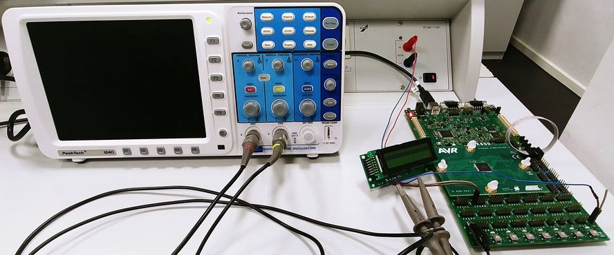

# I2C-Bus

The name I2C-Bus translates into "Inter Integrated Circuit-Bus". Sometimes the bus is called I2C, IIC or I&sup2;C-bus.
<br><br>
The I&sup2;C–Bus allows easy communication between components on the same circuit board or components which are linked via cable.
The most significant features are that there are only two bus lines required. It's based on a simple master/slave relationship between all components. Each device is addressed by an unique address.
Simplicity and flexibility are key characteristics that make this bus attractive to many applications.

## Getting Started
Two use the libraries you have to create these constants before the `include` command in your code:

### I2C-Bus
```c
#define SDA_HIGH	// set SDA line to high
#define SDA_LOW		// set SDA line to low

#define SCL_HIGH	// set SCL line to high
#define SCL_LOW		// set SCL line to low

#define PULLUP_ON	// set SDA line to input
#define PULLUP_OFF	// set both SDA & SCL to output (important to set both!)

#define DELAY		// name of the delay function:
			// the DELAY constant is optional, if you want to use the <util/delay> library.
```

### LCD-Display
```c
#define SEND_BYTE	// name of the send function:
			//		@param Integer address (8-Bit)
			//		@return Integer (1 -> ack, 0 -> transfer fails)

#define DELAY_MS	// name of the delay function:
			// the DELAY constant is optional, if you want to use the <util/delay> library.
```

### Hardware

* mikrocontroller ATMEGA2560
* development board: NTK600
* lcd-display, type HD44780 (4-Bit-Mode)
* oscilloscope

## Resources

* [Official Specification](https://www.nxp.com/docs/en/user-guide/UM10204.pdf) by NXP
* [i2c-bus.org](https://www.i2c-bus.org/)
* [learn.sparkfun.com](https://learn.sparkfun.com/tutorials/i2c)
* [i2c.info](http://i2c.info/i2c-bus-specification)

## Contributing
We're thrilled that you'd like to contribute to this project. Your help is essential for keeping it great.<br>
In general, contributors should develop on branches based off of `master` and pull requests should be to `master`.

## Team
* [Florian Wiech](https://github.com/florianwiech)
* [Thomas Niestroj](https://github.com/Manorka)
